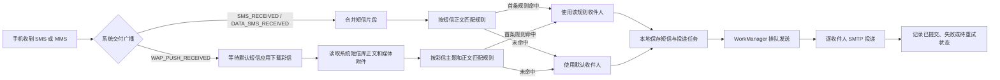
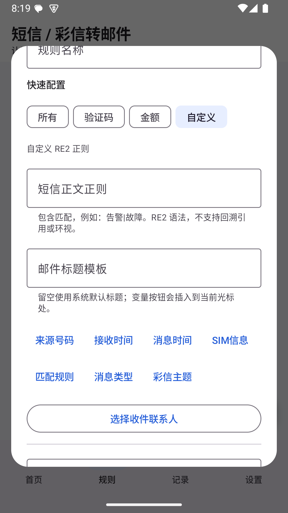
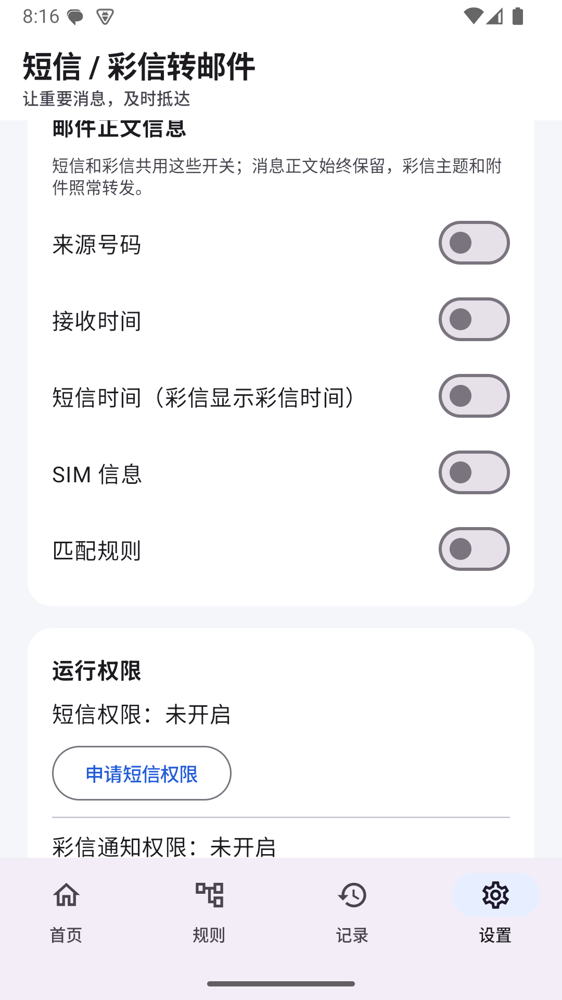
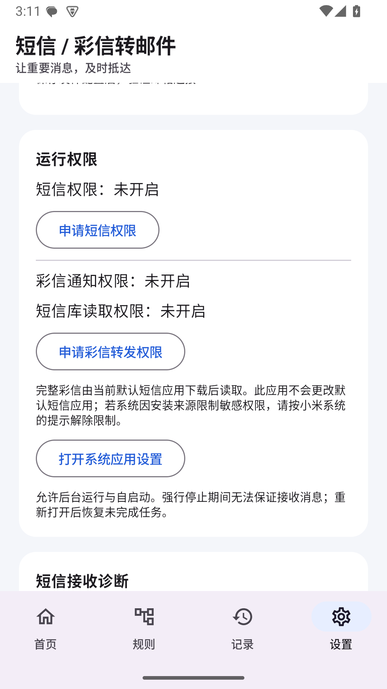

# 短信转邮件：功能与使用图文介绍

## 1. 项目简介

短信转邮件是一款运行在 Android 手机上的本地工具。它在系统交付新短信或彩信后，按照正文（彩信还含主题）匹配规则选择收件人，再通过用户配置的 SMTP 邮箱转发；彩信媒体作为邮件附件。联系人、规则、消息记录和发送队列保存在手机本地，不需要部署服务器。

适用场景包括：

- 将工作通知、告警、账单等短信转发给指定邮箱；
- 将不同类型的短信分发给不同的单人或多人收件组；
- 没有规则命中时，自动发送给默认收件人；
- 网络暂时不可用时先保留发送任务，恢复网络后继续投递。

## 2. 工作流程



系统是否交付某一类短信由 Android 和手机厂商决定。验证码、SMS Retriever、WebOTP 等受系统保护的短信可能不会进入第三方应用，本应用不会绕过系统限制。

彩信需要 `RECEIVE_MMS` 与 `READ_SMS`。Android 将其列为受安装来源限制的权限；系统默认短信应用负责下载彩信，本应用不会接管默认短信角色。默认应用关闭自动下载、彩信网络不可用或权限受阻时，设置页会显示具体的彩信诊断状态。

## 3. 首页：查看运行状态

首页集中显示转发总开关、今日已提交数量、待处理任务和最近记录。首次使用时会提示完成发件邮箱、默认收件人、短信权限和可选的彩信权限配置。


开启转发后，短信进入本地队列；网络不可用时会显示待处理状态，恢复网络后由后台任务继续发送。


应用同时支持深色模式和较大字体显示。


## 4. 联系人管理：一次维护，重复选择

在「设置 → 联系人管理」中维护姓名、邮箱和备注。联系人只保存在本机，不需要通讯录权限。联系人可以被用于默认收件人、规则收件人和测试邮件收件人。


编辑联系人邮箱只影响后续新短信；已经排队的任务仍保留接收时的邮箱快照。被规则或默认收件人引用的联系人，需要先解除引用才能删除。

## 5. 规则分流：四种快速入口

规则页面支持新增、编辑、启停、删除和样例短信测试。规则使用 RE2 正则，默认采用包含匹配。

| 入口 | 适用内容 | 说明 |
| --- | --- | --- |
| 所有 | 所有短信 | 适合统一转发 |
| 验证码 | 验证码、校验码、动态口令、OTP 等关键词 | 预置常见中英文提示 |
| 金额 | 元、人民币、¥、￥、RMB、CNY 等金额表达式 | 适合账单和支付提醒 |
| 自定义 | 业务专用格式 | 手动填写 RE2 正则 |


按列表顺序匹配，仅第一条启用且命中的规则生效，后续规则不再合并。可在规则页点击“调整命中顺序”后拖动规则，顺序会保存在本机；没有规则命中时使用默认收件人。

每条规则可选设置专属邮件标题；留空继续使用系统默认标题。标题变量按钮会插入到光标位置，支持来源号码、接收时间、消息时间、SIM 信息、规则名称、消息类型、消息内容和彩信主题。`{消息内容}` 会合并正文的空白和换行，并截短为最多 50 个 Unicode 码点（含省略号）；附件不会插入标题。标题可能显示在邮件通知中；标题和收件人会在消息入队时固定，后续编辑规则不会改写已排队邮件。

「设置 → 邮件正文信息」提供五个互相独立的开关：来源号码、接收时间、消息时间、SIM 信息、匹配规则。默认全部关闭，短信和彩信共用；消息正文始终保留，彩信主题与媒体附件照常发送。开关状态也在消息接收时快照，避免重试内容随设置变化。




短信规则匹配短信正文；彩信规则将主题和文本片段合并后匹配。只含图片且没有可匹配文本的彩信将使用默认收件人，图片／文件原样作为邮件附件。

## 6. 邮箱配置：使用 SMTP 授权码

在「设置 → 发件邮箱」中选择 QQ、163 或自定义 SMTP 服务，填写发件邮箱和 SMTP 授权码。应用强制使用 TLS/SSL 或 STARTTLS，不支持明文 SMTP。


首次配置完成后，建议先发送测试邮件，再打开短信转发总开关。测试邮件只验证发件配置，不会读取或转发短信。

## 7. 记录与失败恢复

记录页按时间展示短信事件和逐收件人投递状态。正文默认折叠，详情页可以展开正文；失败收件人可以单独重试，已经成功的收件人不会重复发送。


常见状态包括：

- **等待发送**：等待网络、调度或自动重试；
- **已提交**：SMTP 服务器已接受邮件，不等同于已经进入收件箱；
- **配置待修正**：邮箱或授权码需要重新保存；
- **发送失败**：达到自动尝试上限或遇到永久错误；
- **结果不确定**：提交过程中中断，核实邮箱后再决定是否重试。


## 8. 短信与彩信接收诊断

如果短信没有进入记录，可打开「设置 → 短信接收诊断」。彩信诊断另显示通知时间、正文片段数、附件数及下载／读取状态。诊断不保存消息正文、来源号码、附件内容、邮箱或授权码。


点击“复制诊断信息”可以复制脱敏报告，用于区分以下问题：

1. 系统没有交付短信广播；
2. 广播已到达但无法解析；
3. 短信已进入应用，但规则、收件人或 SMTP 队列配置不完整。

彩信额外检查 `RECEIVE_MMS` 与 `READ_SMS` 是否已授予，以及默认短信应用是否已经下载彩信。单封彩信媒体附件总量限制为 15 MiB；超限时不会创建伪成功的邮件记录。

0.2.2 设置页会分别显示彩信通知与短信库读取权限，并提醒完整彩信依赖默认短信应用先下载。下面是 Android 15 模拟器的设置画面；模拟器未授予彩信权限，也没有模拟运营商彩信下载。



## 9. 安全与数据保护

- 短信／彩信正文、来源号码、主题、附件和 SMTP 配置使用 Android Keystore 保护；
- SMTP 授权码不会写入源码、日志或诊断报告；
- 应用不上传短信到开发者服务器；
- 完成记录默认保留 7 天，未完成任务不会自动删除；
- 调试版 APK 使用 Android Debug 签名，正式发布前必须更换正式签名并完成渠道审核。

## 10. 开发与验证

项目使用 Kotlin、Jetpack Compose、Room 和 WorkManager，最低 Android 8.0，目标 API 36。常用验证命令：

```sh
./gradlew :core:test :app:testDebugUnitTest :app:assembleDebug :app:lintDebug
./gradlew :app:connectedDebugAndroidTest
```

0.2.2 的 45 项自动化测试和 APK 构建已通过 Android 15 模拟器验证；这不代表模拟器完成了真实运营商彩信下载。小米 14 实机的彩信权限、自动下载、图片邮件与 TalkBack 仍需按 `docs/DEVICE-ACCEPTANCE.md` 单独验收。

更多内容：

- [项目 README](../README.md)
- [界面截图索引](SCREENSHOTS.md)
- [架构说明](ARCHITECTURE.md)
- [测试报告](TEST-REPORT.md)
- [真机与邮箱验收清单](DEVICE-ACCEPTANCE.md)
