# 实际应用界面

以下是 Android 15 模拟器上的实际应用截图。展示中的短信、号码和邮箱均为测试数据。

## 首页与主题

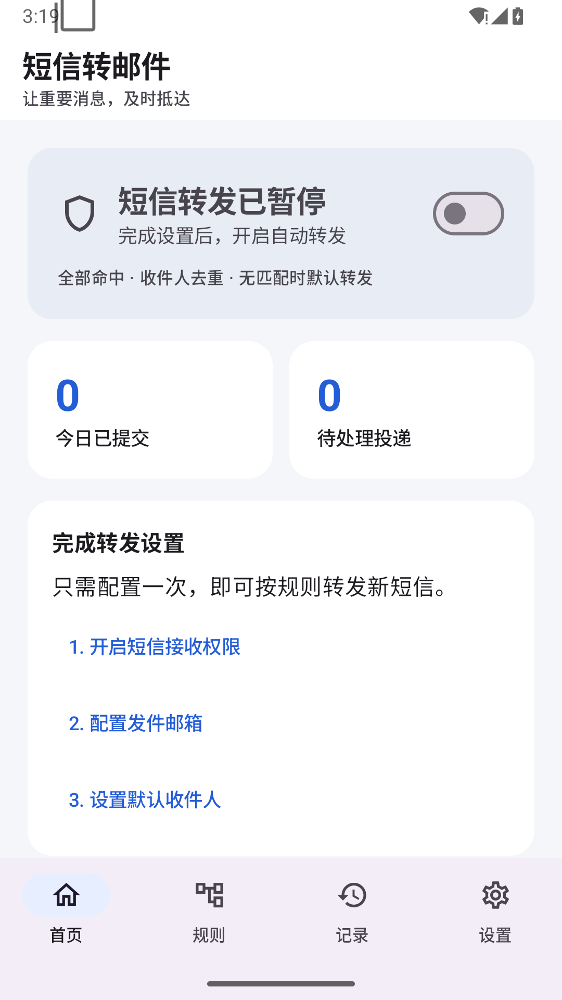
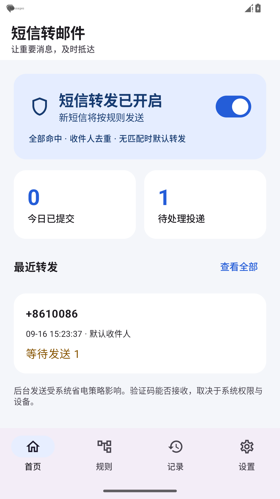
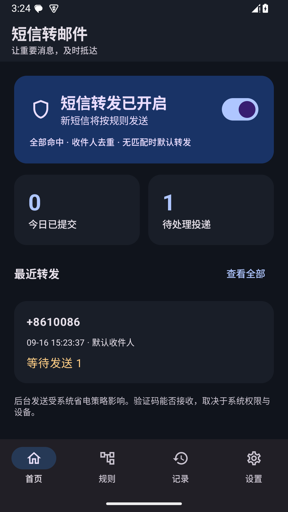
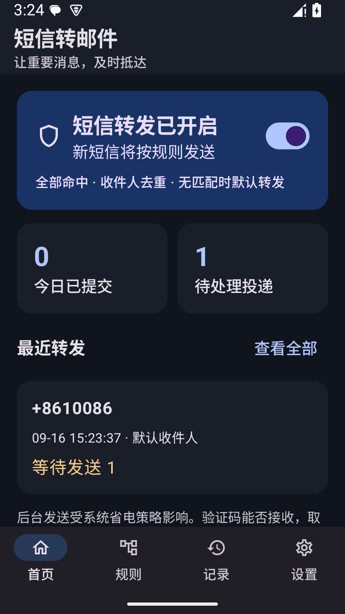

## 主页面

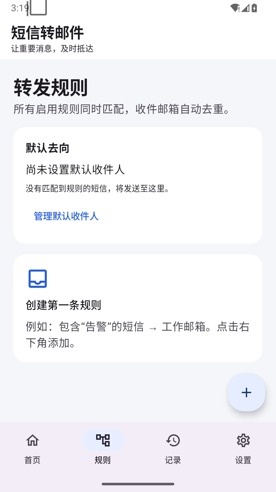
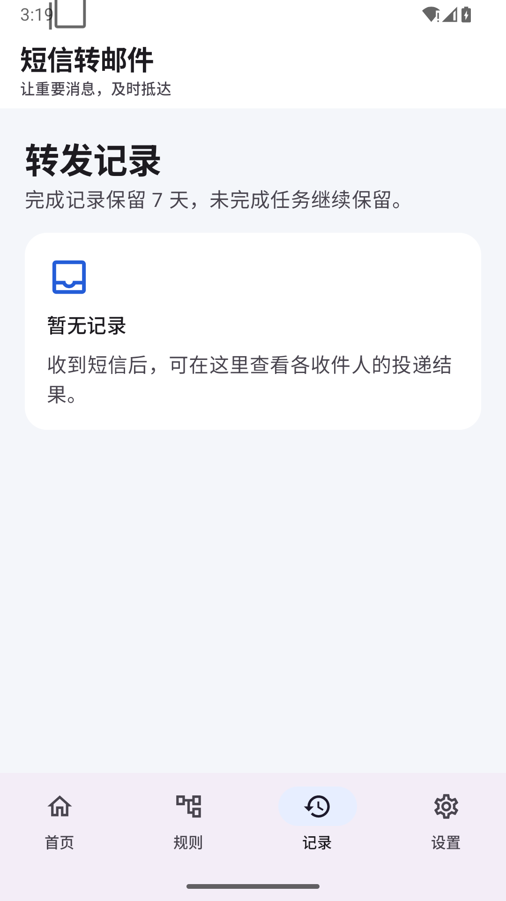
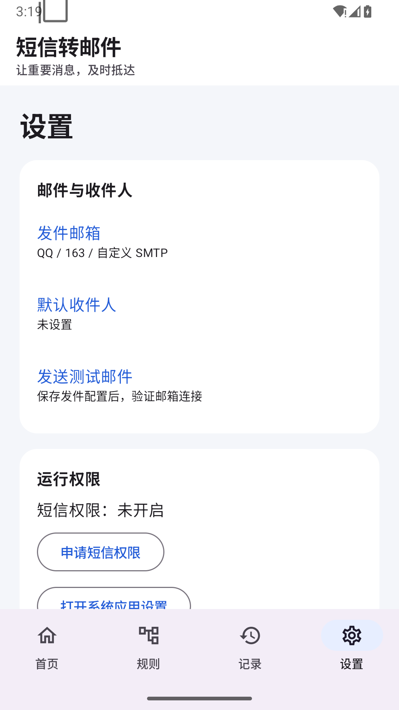

## 配置与详情

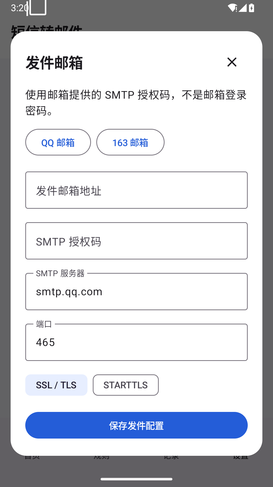
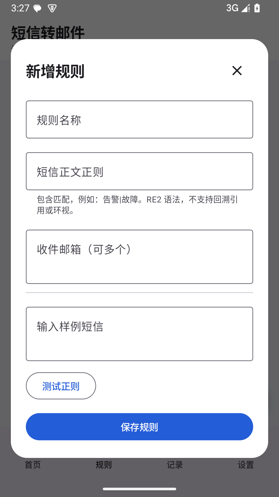
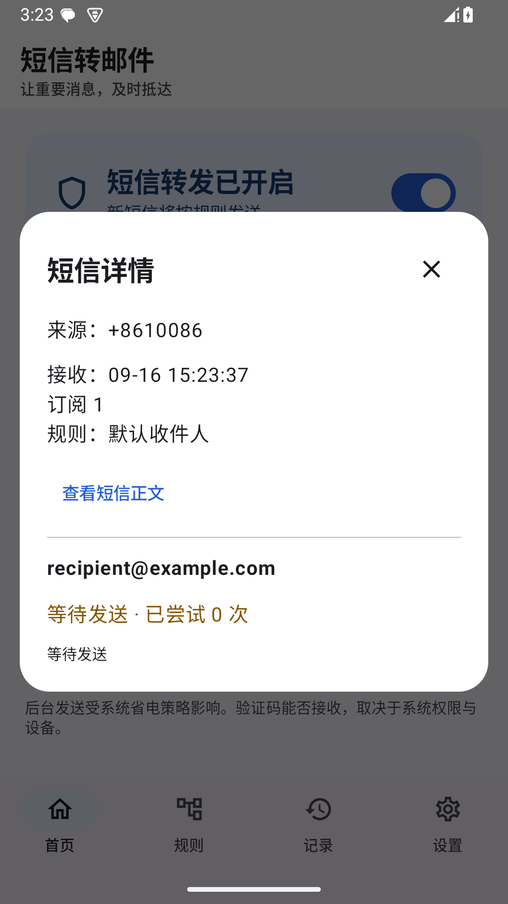
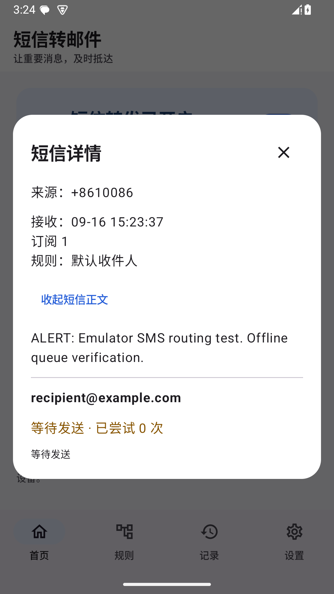
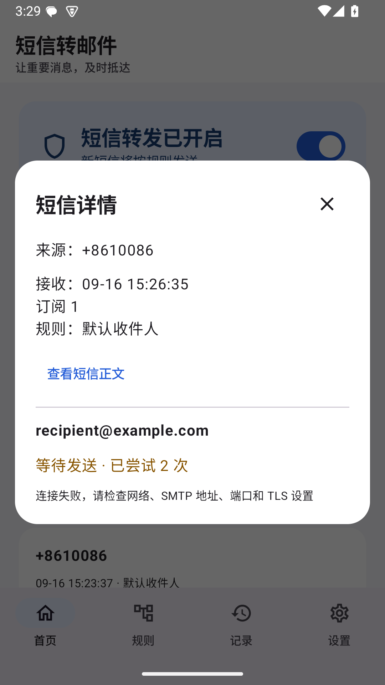
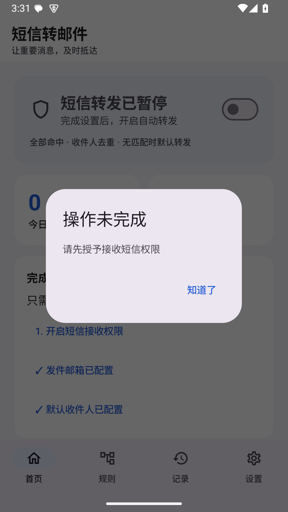

## 0.2.0 联系人与快速规则

0.2.0 的联系人管理、新增联系人、联系人选择器和验证码预设流程已由 Compose UI 测试在 Android 15 模拟器中验证；截图来自模拟器，设备实测仍待小米 14 真机验收。当前截图：

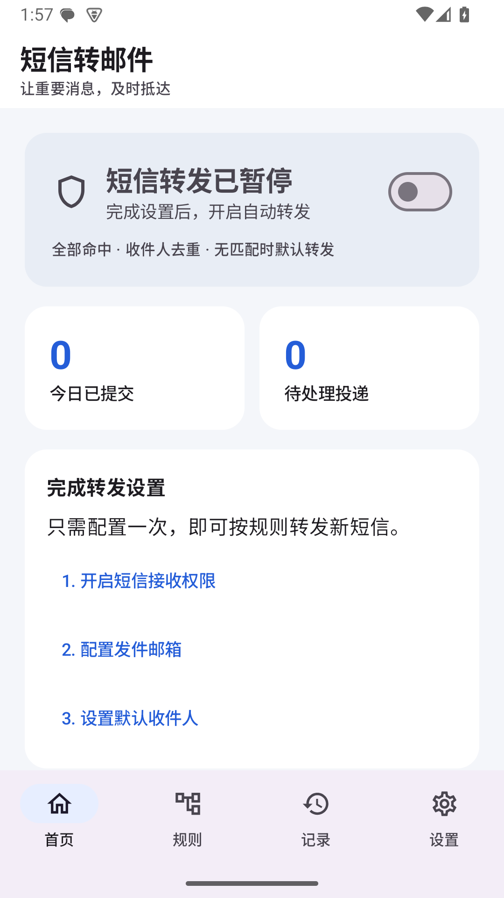
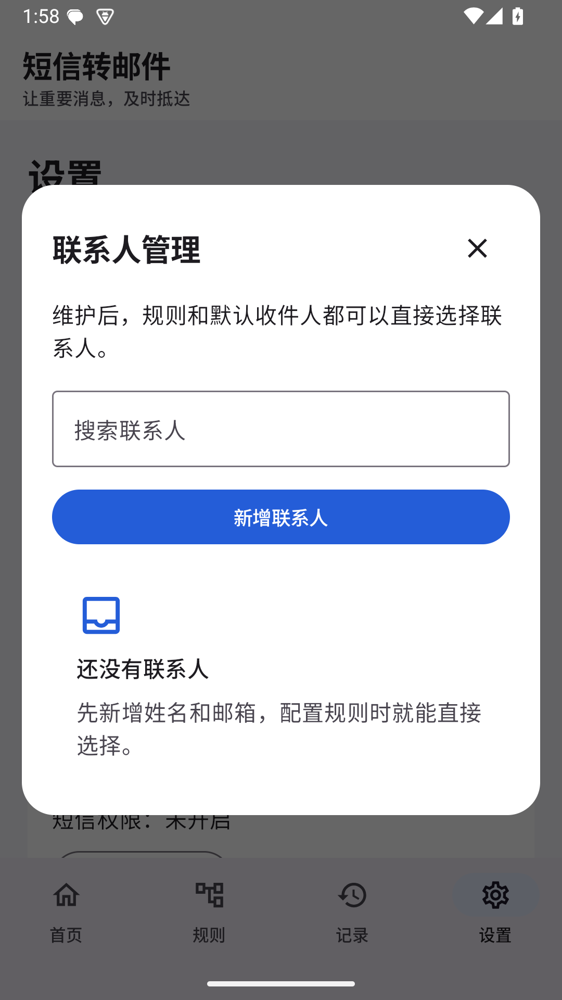

0.2.1 新增短信广播诊断示例（仅显示时间、短信段数和正文长度，不显示正文；下方提供脱敏诊断复制入口）：

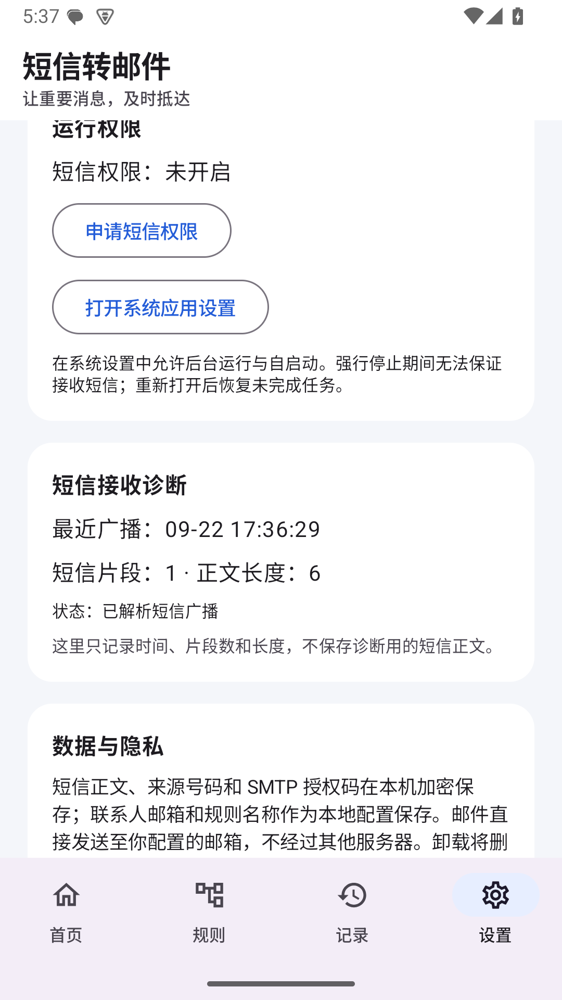
